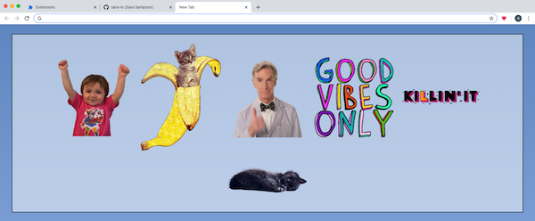

# Daily Dose Chrome Extension

 ***Get your daily dose of motivation with this chrome extension***

<!-- Add to Chrome: [Chrome Web Store - Daily Dose](https://chrome.google.com/webstore/detail/daily-dose/fbkhoaljbboohomeifchfbepflpckpmj) -->

## Description

Sometimes you need a little dose of positivity or motivation throughout your day. This chrome extension will randomly show you cute/motivational gifs while your using Chrome to help brighten your day and improve your productivity!

## Features

### Motivational stickers appear in your browser's active tab throughout the day


### After clicking a sticker, a sound is played and the sticker is added to your collection

``` js
// Determines if/where a sticker should appear
function stickerAppearance() {
  // Pick random location on screen for sticker to appear
  let yPosition = Math.floor(Math.random() * screen.height);
  let xPosition = Math.floor(Math.random() * screen.width);
  if (yPosition > 300) {
    yPosition = yPosition - 300;
  }
  if (xPosition > 300) {
    xPosition = xPosition - 300;
  }

  const numCollectableGifs = 9;
  // Frequency of gif showing up
  let chance = Math.random();
  // Pick random collectable gif id
  let gifId = selectRandom(1, numCollectableGifs);

  if (chance < 0.5) {
    // Display sticker
    let div = document.createElement("DIV");
    div.id = "cat";
    imgURL = chrome.extension.getURL("images/collect" + gifId + ".gif");
    img.src = imgURL;
    div.style.setProperty("--top-placement", yPosition + "px", "important");
    div.style.setProperty("--left-placement", xPosition + "px", "important");
    div.appendChild(img);
    document.body.appendChild(div);
    div.addEventListener("click", stickerClick);
  }
}

// Selects random int inclusive
function selectRandom(min, max) {
  return Math.floor(Math.random() * (max - min + 1)) + min;
}

// Called when sticker is clicked
function stickerClick() {
  // Play sounds when sicker clicked
  const sound = new Audio();
  sound.src = chrome.extension.getURL("sounds/meow.mp3");
  sound.volume = 0.1;
  sound.play();

  // Replace sticker with heart animation on click
  img.src = chrome.extension.getURL("images/clicked.gif");
  window.setTimeout(function clearImage() {
    img.removeAttribute("src");
  }, 700);

  // Add sticked to collection using Chrome's storage API
  chrome.storage.sync.get("stickers", function (profileObj) {
    var profile = profileObj;
    // console.log("profile " + profile);
    // Check if any stickers have been saved
    if (Object.keys(profile).length === 0) {
      // Add string of imgURL
      chrome.storage.sync.set({ stickers: [imgURL] }, function () {
        // console.log("added to storage");
      });
      var key = imgURL;
      var file = {};
      file[key] = 1;
      chrome.storage.sync.set(file, function () {
        // console.log(imgURL + ":" + 1);
      });
    } else {
      // Seen multiple stickers --> add new sticker
      if (jQuery.inArray(imgURL, profile["stickers"], 0) > -1) {
        chrome.storage.sync.get(imgURL, function (timesSeen) {
          var key = imgURL;
          var file = {};
          file[key] = timesSeen[imgURL] + 1;
          chrome.storage.sync.set(file, function () {
            // console.log(file);
          });
        });
      } else {
        var stickers = profile["stickers"];
        stickers.push(imgURL);
        chrome.storage.sync.set({ stickers: stickers }, () => {
          // console.log("added sticker to storage");
        });
        var key = imgURL;
        var file = {};
        file[key] = 1;
        chrome.storage.sync.set(file, function () {
          // console.log(file);
        });
      }
    }
  });
}
```

### Custom new tab page where you can view the stickers you've collected



### Chrome extension popup with a heart image to show how many times you've clicked on that sticker


## Permissions

* Replace the page you see when opening a new tab
* Read your browsing history

## Technologies

* Chrome's Storage API
* JavaScript
* jQuery
* HTML
* CSS

## Future Work

* Options page
  * Turn on/off for specifc website
  * Change new tab background
* Todos widget on new tab page
* Add bookmarks widget to new tab page

## Credits

* V1 Contributors
  * [James Nghiem](https://github.com/jamesnghiem)
  * [Evan Chang](https://github.com/pkmnfreak)
  * [Jason Yeung](https://github.com/JasonJYeung)
* Images from Unsplash
* GIFs/stickers from [Giphy](https://giphy.com/)
* Sounds from [Free Sounds Library](https://www.freesoundslibrary.com/)
